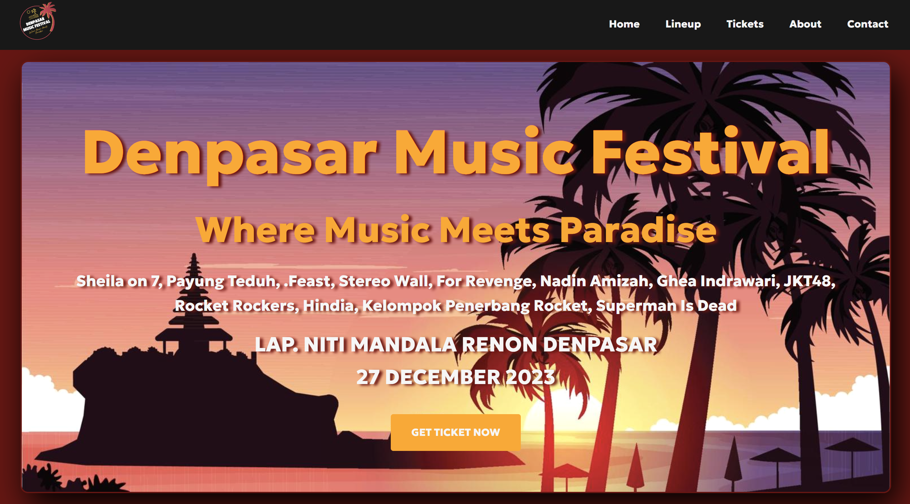
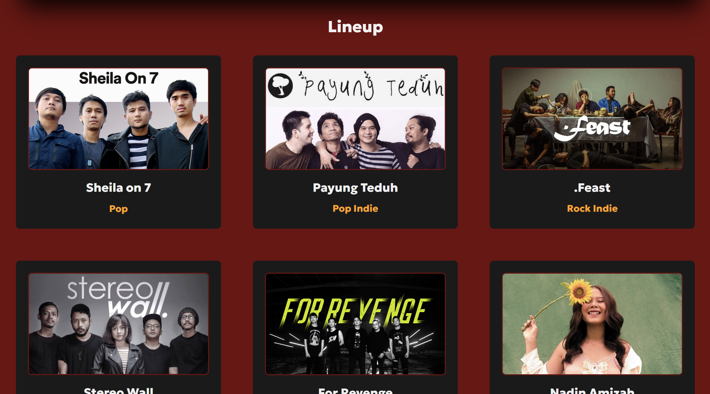
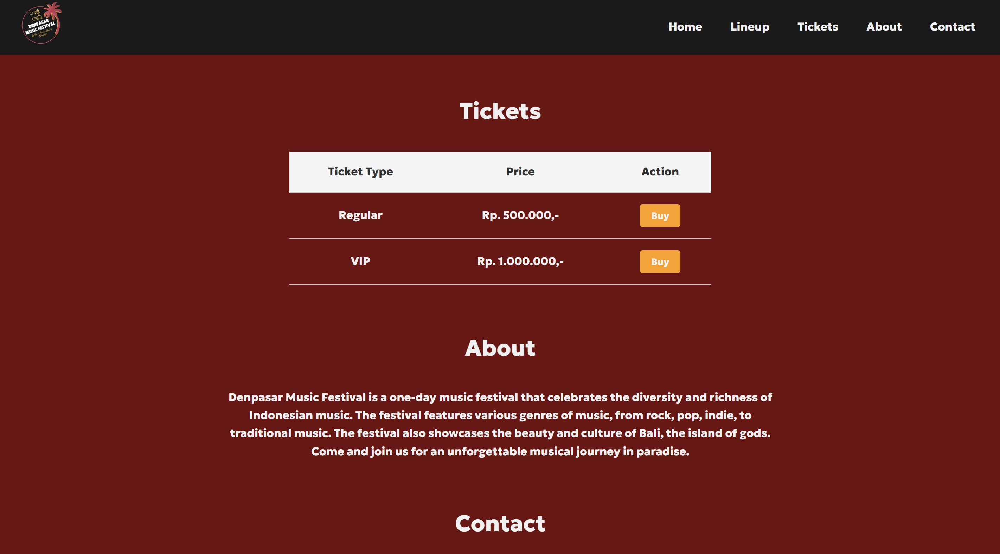
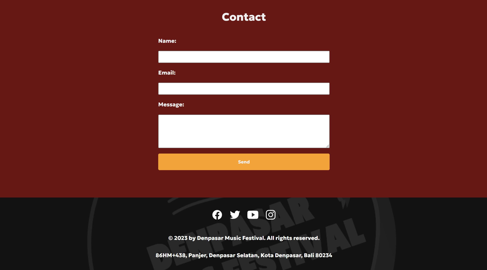

# Denpasar Music Festival - Web Pembelian Tiket Konser

Ini adalah project website untuk pembelian tiket konser Denpasar Music Festival. Project ini dibuat sebagai tugas dari UKM Progress ITB STIKOM BALI.

## Anggota Tim

- I Putu Eka Surya Gempita (220030429)

## Deskripsi Project

Denpasar Music Festival adalah project website yang memungkinkan pengguna untuk membeli tiket konser acara musik Denpasar Music Festival. Project ini bertujuan untuk memberikan kemudahan bagi para penggemar musik untuk mendapatkan tiket konser dengan cepat dan mudah. Di dalam website, pengguna dapat melihat lineup artis yang akan tampil, harga tiket, dan melakukan pembelian tiket secara online.

## Cara Menjalankan Project

1. Pastikan Anda memiliki peramban (browser) web yang terbaru di perangkat Anda.
2. Buka file `index.html` di peramban web Anda.
3. Jelajahi halaman website untuk melihat informasi tentang acara, lineup artis, harga tiket, dan untuk melakukan pembelian tiket.

## Prasyarat

Tidak ada prasyarat khusus yang diperlukan untuk menjalankan project ini. Project ini sepenuhnya berbasis pada teknologi web standar (HTML, CSS, dan JavaScript).

## Tampilan Aplikasi

